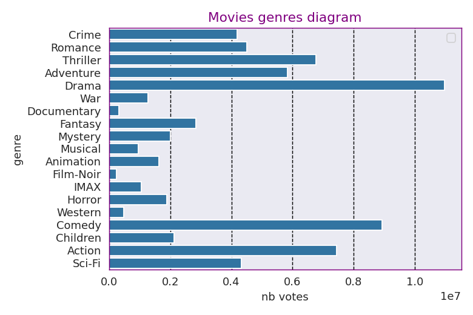
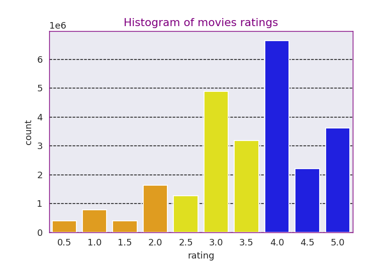
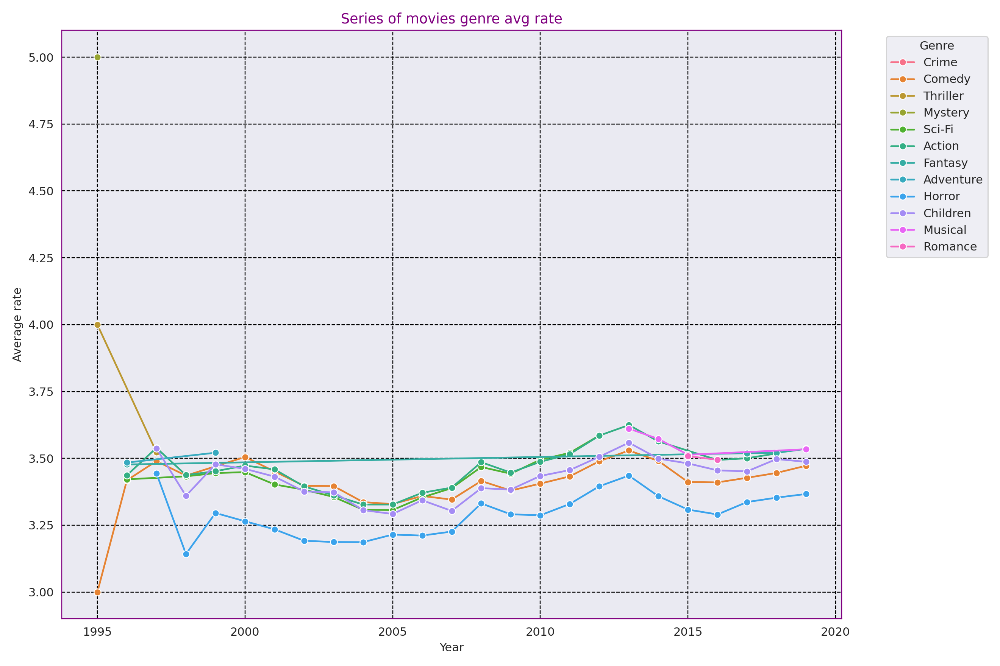

# Movie Recommendation Project with Spark

This academic project aims to implement a movie recommendation system using Apache Spark technology. Spark is an open-source distributed computing platform, suitable for processing large volumes of data, offering advanced features for parallel data processing and analysis.


## Repository Structure

- **data**: Directory containing the project's data.
  - `ml-25m.zip`: Compressed file containing the movie database from GroupLens. It is necessary to decompress this file beforehand.
- **images**: Directory containing graphs of the data exploration results.
- **logs**: Directory containing log files.
  - `recommendations.log`: Log file containing the results of using the recommendation model.
- **src**: Directory containing the source code.
  - `make_recommendation.py`: Python script to generate movie recommendations.
  - `als_model`: Folder containing the trained ALS model.
- **README.md**: Main README file of the project.
- **requirements.txt**: File containing the list of Python dependencies required to run the project. Install them by using : 
```bash
$ pip install -r requirements.txt
```

## Prerequisites

Before running the project, make sure you have the following installed:

- Python
- Java Development Kit (JDK): [Download](https://www.oracle.com/java/technologies/javase/javase8-archive-downloads.html)
- Apache Spark: [Download](https://spark.apache.org/downloads.html)

## Data Source

The dataset used in this project is obtained from the MovieLens website, specifically the MovieLens 25M dataset. MovieLens is a non-commercial movie recommendation website, and the datasets are often used for research purposes. The MovieLens 25M dataset contains around 25 million ratings applied to 62,000 movies by 162,000 users. More information about the dataset can be found on the [MovieLens website](https://grouplens.org/datasets/movielens/25m/).

Please note that the dataset is provided as a compressed file `ml-25m.zip` in the `data` directory. You'll need to unzip this file before using the dataset.


## Usage

To use the recommendation model via the command line, execute the `make_recommendation.py` script with the following arguments: `user_id` and `num_recommendations`.
```bash
$ python3 scr/make_recommendation.py --user_id 471 --num_recommendations 5
```


The recommendation results will be stored in the log file [recommendations](logs/recommendations.log).

## Plots

Here are some screenshots of the data exploration results:

- Genres Diagram: 

- Notes Histogram: 

- Evolution of Average Genre Ratings: 

